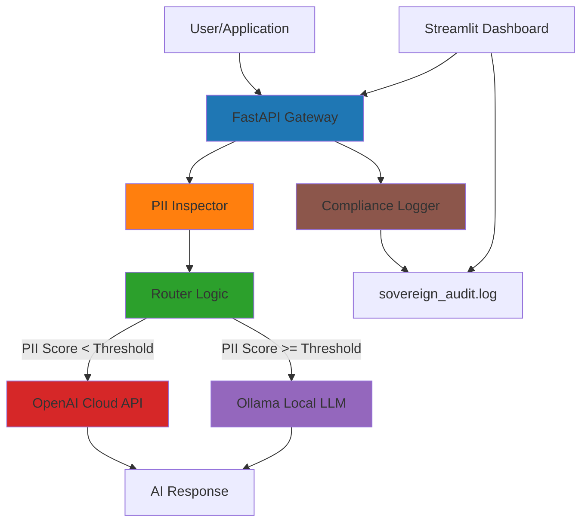

# 🛡️ Sovereign AI Gateway - Australian Data Sovereignty Enforcement

> **Production-grade AI Security Gateway enforcing Australian data sovereignty by dynamically routing sensitive prompts to local LLMs while allowing non-sensitive prompts to use public cloud AI models.**

[](https://www.python.org/)
[](https://fastapi.tiangolo.com/)
[](LICENSE)

---

## 📋 Table of Contents

- [Overview](#overview)
- [Architecture](#architecture)
- [Features](#features)
- [Quick Start](#quick-start)
- [Usage](#usage)
- [Configuration](#configuration)
- [Compliance & Auditing](#compliance--auditing)
- [Testing](#testing)
- [Deployment](#deployment)
- [Resume Hook](#resume-hook)

---

## 🎯 Overview

The **Sovereign AI Gateway** is a hybrid inference gateway designed for Australian enterprises requiring strict data sovereignty compliance. It automatically:

1. **Inspects** all prompts for Australian-specific PII (Medicare, TFN, driver's licence, etc.)
2. **Routes** sensitive content exclusively to **local LLMs** (Ollama)
3. **Allows** general prompts to reach high-quality **cloud AI models** (OpenAI)
4. **Logs** all decisions for compliance auditing (ISO 27001, ASD Essential 8)

This architecture mirrors real-world deployments in:
- **Defence & National Security**
- **Financial Services**
- **Healthcare**
- **Government Agencies**
- **Telecommunications**

---

## 🏗️ Architecture



### Component Breakdown

#### **1. FastAPI Gateway (`gateway/gateway.py`)**
- Main API endpoint: `POST /gateway`
- Health checks: `GET /health`
- Audit log access: `GET /audit/recent`
- Handles request/response lifecycle

#### **2. PII Inspector (`gateway/inspector.py`)**
Detects Australian identifiers:
- **Medicare numbers** (10-digit with checksum validation)
- **Tax File Numbers (TFN)** (8-9 digit with checksum)
- **Driver's licence numbers** (state-specific formats)
- **Mobile phone numbers** (04XX XXX XXX)
- **Postal addresses** (postcodes)
- **Sensitive keywords** (medical, financial, legal contexts)

#### **3. Router (`gateway/router.py`)**
Decision logic:
- **PII Score < Threshold (0.3)** → Route to **OpenAI Cloud**
- **PII Score >= Threshold** → Route to **Ollama Local LLM**
- Configurable threshold via environment variable

#### **4. Compliance Logger (`gateway/logging_utils.py`)**
- Structured JSON logging to `sovereign_audit.log`
- Human-readable summaries
- Suitable for ISO 27001 / ASD Essential 8 evidence

#### **5. Streamlit Dashboard (`dashboard/app.py`)**
Real-time visualization:
- Prompt input interface
- PII score visualization
- Route decision indicators (🔴 Sovereign / 🟢 Cloud)
- Live audit log viewer
- Statistics and metrics

---

## ✨ Features

### 🔍 **Australian PII Detection**
- Medicare number validation with checksum
- TFN validation with weighted checksum
- State-specific driver's licence formats
- Mobile number patterns (04XX XXX XXX)
- Context-aware sensitive keyword detection

### 🚦 **Intelligent Routing**
- Automatic cloud vs. local routing based on PII sensitivity
- Configurable threshold for routing decisions
- Fallback to local LLM if cloud API unavailable

### 📊 **Compliance Logging**
- Structured JSON audit logs
- Timestamp, route, PII score, model used
- No prompt content stored (privacy-preserving)
- Suitable for regulatory compliance evidence

### 🎨 **Real-Time Dashboard**
- Visual PII score indicators
- Route decision visualization
- Live audit log tailing
- Statistics and metrics

### 🐳 **Docker Compose Deployment**
- One-command deployment
- All services networked internally
- Health checks and auto-restart
- Volume persistence for logs

---

## 🚀 Quick Start

### Prerequisites

- **Docker** and **Docker Compose** installed
- **OpenAI API Key** (optional, for cloud routing)
- **8GB+ RAM** (for local LLM)

### 1. Clone Repository

```bash
git clone <repository-url>
cd sovereign_ai_gateway
```

### 2. Configure Environment

Create a `.env` file (optional):

```bash
# OpenAI Configuration (optional)
OPENAI_API_KEY=your_openai_api_key_here
OPENAI_MODEL=gpt-4o

# Ollama Configuration
OLLAMA_MODEL=llama3  # or phi3, mistral, etc.

# Routing Threshold
PII_THRESHOLD=0.3  # 0.0-1.0, higher = more sensitive
```

### 3. Start Services

```bash
docker-compose up -d
```

This will:
- Build and start the FastAPI gateway (`http://localhost:8000`)
- Build and start the Streamlit dashboard (`http://localhost:8501`)
- Start Ollama service

**Note:** After Ollama starts, you may need to manually pull the model:

```bash
docker exec -it sovereign_ollama ollama pull llama3
```

Or use the Makefile:

```bash
make pull-ollama OLLAMA_MODEL=llama3
```

### 4. Access Dashboard

Open your browser to: **http://localhost:8501**

### 5. Test the Gateway

```bash
# Clean prompt (should route to cloud)
curl -X POST http://localhost:8000/gateway \
  -H "Content-Type: application/json" \
  -d '{"prompt": "What is the capital of Australia?"}'

# Sensitive prompt (should route to local)
curl -X POST http://localhost:8000/gateway \
  -H "Content-Type: application/json" \
  -d '{"prompt": "My Medicare number is 1234 567 890"}'
```

---

## 📖 Usage

### API Endpoint

**POST `/gateway`**

Request:
```json
{
  "prompt": "Your prompt text here",
  "user_id": "optional_user_id",
  "session_id": "optional_session_id"
}
```

Response:
```json
{
  "response": "AI model response text",
  "route": "cloud" | "sovereign",
  "pii_score": 0.75,
  "pii_detected": [
    {
      "type": "medicare",
      "value": "12****890",
      "confidence": 0.95,
      "position": [20, 33]
    }
  ],
  "model_used": "gpt-4o" | "llama3 (local)",
  "timestamp": "2024-01-15T10:30:00",
  "processing_time_ms": 1250.5
}
```

### Example Requests

#### Clean Prompt (Cloud Route)
```bash
curl -X POST http://localhost:8000/gateway \
  -H "Content-Type: application/json" \
  -d @examples/sample_clean.json
```

#### Sensitive Prompt (Sovereign Route)
```bash
curl -X POST http://localhost:8000/gateway \
  -H "Content-Type: application/json" \
  -d @examples/sample_sensitive.json
```

---

## ⚙️ Configuration

### Environment Variables

| Variable | Default | Description |
|----------|---------|-------------|
| `OPENAI_API_KEY` | (empty) | OpenAI API key for cloud routing |
| `OPENAI_MODEL` | `gpt-4o` | OpenAI model to use |
| `OLLAMA_BASE_URL` | `http://ollama:11434` | Ollama service URL |
| `OLLAMA_MODEL` | `llama3` | Local LLM model name |
| `PII_THRESHOLD` | `0.3` | PII score threshold for routing (0.0-1.0) |

### Adjusting Sensitivity

Lower threshold (e.g., `0.2`) = More prompts route to cloud  
Higher threshold (e.g., `0.5`) = More prompts route to local

```bash
export PII_THRESHOLD=0.5
docker-compose up -d
```

---

## 📋 Compliance & Auditing

### Audit Log Format

Each request generates a structured JSON log entry:

```json
{
  "timestamp": "2024-01-15T10:30:00.123456",
  "route": "sovereign",
  "pii_score": 0.85,
  "pii_types": ["medicare", "tfn"],
  "model_used": "llama3 (local)",
  "user_id": "user_123",
  "session_id": "session_456",
  "ip_address": "192.168.1.100",
  "prompt_length": 150,
  "response_length": 500,
  "processing_time_ms": 1250.5,
  "sovereignty_enforced": true
}
```

### Compliance Standards

This logging format supports:
- **ISO 27001** - Information Security Management
- **ASD Essential 8** - Australian Cyber Security Centre guidelines
- **Privacy Act 1988** - Australian privacy legislation
- **APRA CPS 234** - Information Security (Financial Services)

### Viewing Audit Logs

```bash
# View recent logs
tail -f sovereign_audit.log

# Query logs (JSON format)
cat sovereign_audit.log | grep "sovereignty_enforced.*true" | jq
```

---

## 🧪 Testing

### Run Tests

```bash
# Install test dependencies
pip install -r requirements.txt

# Run all tests
pytest tests/

# Run specific test file
pytest tests/test_inspector.py

# Run with coverage
pytest --cov=gateway tests/
```

### Test Coverage

- ✅ PII detection (Medicare, TFN, mobile, etc.)
- ✅ Routing logic (cloud vs. sovereign)
- ✅ Threshold configuration
- ✅ Multiple PII type detection

---

## 🚢 Deployment

### Production Considerations

1. **Security**
   - Restrict CORS origins in `gateway.py`
   - Use secrets management (AWS Secrets Manager, HashiCorp Vault)
   - Enable HTTPS/TLS
   - Implement authentication/authorization

2. **Scaling**
   - Use Kubernetes for orchestration
   - Scale gateway API horizontally
   - Use Redis for session management
   - Load balance across multiple Ollama instances

3. **Monitoring**
   - Integrate with Prometheus/Grafana
   - Set up alerting for high PII scores
   - Monitor API latency and error rates

4. **Logging**
   - Ship logs to centralized system (ELK, Splunk)
   - Set log retention policies
   - Encrypt audit logs at rest

### Kubernetes Deployment

See `k8s/` directory for Kubernetes manifests (if provided).

---

## 🎯 Resume Hook

> **"Architected a Sovereign AI 'Data Diode' gateway enforcing Australian data sovereignty by dynamically routing sensitive prompts to on-prem LLMs while allowing non-sensitive prompts to public cloud AI models. Implemented PII detection for Medicare, TFN, driver's licence, and mobile numbers with compliance logging suitable for ISO 27001 and ASD Essential 8 evidence."**

---

## 📚 Additional Resources

### Australian PII Formats

- **Medicare**: 10 digits (XXXX XXXX XX)
- **TFN**: 8-9 digits
- **Driver's Licence**: Varies by state (NSW: 8 digits, VIC: 8 digits, QLD: 1 letter + 8 digits)
- **Mobile**: 04XX XXX XXX

### Local LLM Options

- **Llama 3** (8B, 70B) - Meta
- **Phi-3** (3.8B, 14B) - Microsoft
- **Mistral** (7B, 8x7B) - Mistral AI
- **Qwen** (7B, 14B) - Alibaba

---

## 🤝 Contributing

Contributions welcome! Please:
1. Fork the repository
2. Create a feature branch
3. Add tests for new features
4. Submit a pull request

---

## 📄 License

MIT License - See [LICENSE](LICENSE) file for details.

---

## 🙏 Acknowledgments

Built for Australian enterprises requiring strict data sovereignty compliance. Designed to meet Defence, Finance, Healthcare, and Government security requirements.

---

**🛡️ Protecting Australian Data Sovereignty, One Prompt at a Time.**

